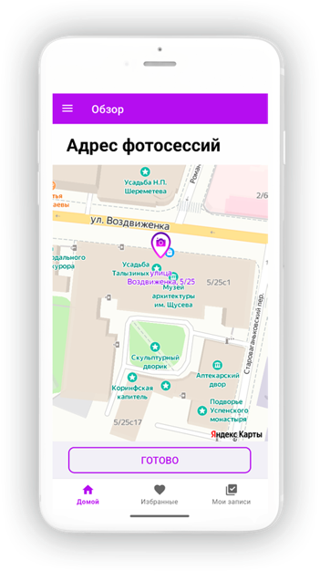
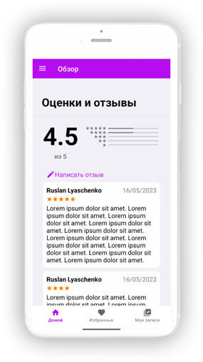

<h1>
  
  PictueSnap
</h1>

Приложение для быстрого и эффективного поиска фотографов по своему местоположению.

## Основной функционал:

* Бронирование услуг в режиме реального времени
* Отображение на карте местоположения фотосессий
* Публикация отзывов
* Просмотр профилей пользователей
* Оценка услуг фотографов
* Просмотр портфолио фотографов

## Разметка

> Vk [ruslan.itpro](https://vk.com/ruslan.itpro)&nbsp;&middot;&nbsp;
> GitHub [@versoIt](https://github.com/versoit)